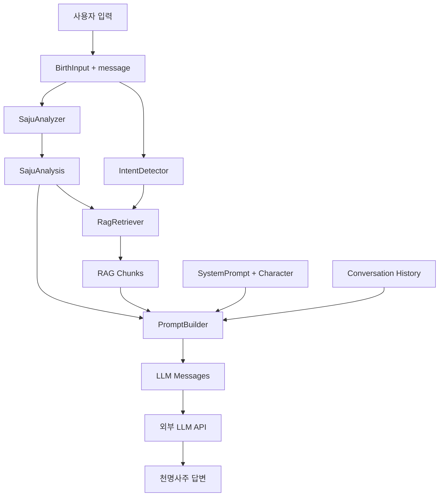

# chungi_t 아키텍처

천명사주 **개인 사주 기반 LLM 대화 엔진** 전용 프로젝트입니다.

## 데이터 흐름



## 디렉토리 구조

```
chungi_t/
├── data/
│   ├── character.json          # 캐릭터 페르소나
│   ├── runtime-config.json     # 운영 설정
│   ├── corpus/                 # 명리학·사주 코퍼스
│   │   ├── myeongri-basics.json
│   │   ├── saju-elements.json
│   │   └── consultation-templates.json
│   └── rag/                    # (확장) 벡터 인덱스
├── prompts/
│   └── system-prompt.md        # LLM 시스템 프롬프트
├── src/
│   ├── saju/analyzer.ts        # 사주 계산·분석
│   ├── rag/retriever.ts        # RAG 검색
│   ├── conversation/
│   │   ├── engine.ts           # 대화 엔진 진입점
│   │   └── prompt-builder.ts   # LLM 메시지 조합
│   └── index.ts
└── tests/unit/                 # 테스트 하네스
```

## 핵심 모듈

### 1. SajuAnalyzer (`src/saju/analyzer.ts`)
- **입력**: `BirthInput` (년·월·일·시·성별·양/음력)
- **출력**: `SajuAnalysis` (사주팔자, 일간, 오행, 십신, 용신, 요약)
- 개인 사주를 LLM 프롬프트 `<personal_saju>` 블록으로 변환

### 2. RagRetriever (`src/rag/retriever.ts`)
- **입력**: 사용자 질문 + `SajuAnalysis`
- **출력**: 관련 명리학 코퍼스 청크 Top-K
- 키워드 매칭 + 사주 프로필(일간·오행·십신) 가중치

### 3. ConversationEngine (`src/conversation/engine.ts`)
- `prepareConversation()`: 사주 분석 → RAG 검색 → 프롬프트 조합
- **출력**: LLM API에 바로 전달 가능한 `messages[]`

## LLM 연동 방법

```typescript
import { prepareConversation } from './src/index.js'

const result = prepareConversation({
  birth: { year: 1990, month: 5, day: 15, hour: 14, gender: 'female', calendar: 'solar' },
  message: '올해 직업운이 어떤가요?',
  history: [],
})

// result.messages → OpenAI / Anthropic / etc. API에 전달
const response = await openai.chat.completions.create({
  model: 'gpt-4o',
  messages: result.messages,
})
```

## RAG 확장 계획

1. **Phase 1 (현재)**: 키워드 + 사주 프로필 가중치 검색
2. **Phase 2**: 임베딩 벡터 DB (OpenAI embeddings + local index)
3. **Phase 3**: 대운·세운 동적 계산 + 시기별 코퍼스

## 운영 규칙

- 건강·재물·법률·미래 단정 금지
- 괄호 행동 묘사 TTS 제외 (`buildCheongiTtsText`)
- 같은 위로/운세 멘트 반복 금지
