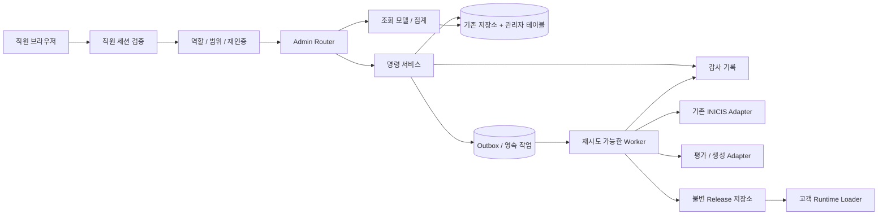

# 아키텍처 제안
현재 단일 Express 앱을 확장한다. 새 프레임워크·벡터 DB·메시지 브로커 도입을 전제하지 않는다.

## 모듈 제안
src/admin/router.ts: 관리자 API 조합.
src/admin/auth.ts, permissions.ts: 서버 검증, scope, 민감 조치 재인증.
src/admin/services/: 주문 조회·환불 명령·콘텐츠 발행 등 유스케이스.
src/admin/stores/: 관리자 DB 접근 및 기존 주문/보고서 adapter.
src/admin/jobs/: outbox worker, lease, retry, idempotency.
src/admin/analytics/: 이벤트 검증·집계.
관리 UI 위치는 기존 정적 빌드 관례를 확인하여 사주/admin 또는 별도 빌드 산출물로 선택한다. 브라우저가 DB 서버 키를 갖지 않는다.

## 읽기 경계
기존 order-store/report-store에 관리자용 제한 query 메서드를 추가하거나 별도 adapter로 연결한다. payload 전체를 목록 API에 반환하지 않는다. 운영 집계는 인덱스 기반 read model로 분리하고 원본 JSON 전수 파싱을 요청마다 수행하지 않는다.

## 쓰기 경계
인증 → 권한 → 입력검증 → 대상 revision 확인 → 원장/감사/outbox 트랜잭션 → 작업 실행 → 결과 반영.
Postgres와 REST가 혼재하므로 다중 원자성이 필요한 경로는 서버 전용 transaction adapter/RPC로 일관되게 구현한다. 여러 REST PATCH가 하나의 트랜잭션이라고 가정하지 않는다.

## 외부 시스템과 원자성
PG 호출과 DB commit을 하나의 트랜잭션으로 만들 수 없다. intent를 먼저 저장하고 외부 결과를 기록한 뒤 내부 상태를 확정한다. 응답 유실은 unknown으로 대사한다. 금전 작업 재시도 전에 PG 상태를 조회한다. 정확히 한 번 호출을 보장한다고 표현하지 않고 중복 효과를 차단한다.

## 코퍼스 실행 반영
현재 파일 레지스트리와 fingerprint 캐시를 유지하는 1차 전략: 관리자 승인본 → 검증된 파일 bundle → 버전 관리된 release/배포 → 실행 fingerprint 확인. UI 저장만으로 운영 반영 표시 금지.
2차 선택: immutable 원격 snapshot + active pointer + runtime version cache. 전 인스턴스가 version을 확인하고 진행 중 생성은 시작 시 snapshot에 고정한다. 프로세스 내 clearCache만으로 전체 서버리스 배포가 갱신됐다고 가정하지 않는다.

## 가용성·복구
영속 job lease와 재시작 회수, 최대 재시도, 지수 backoff, dead-letter 상태를 구현한다. 운영에서 memory fallback이면 관리자 쓰기를 차단하고 readiness 실패를 반환한다. 기존 고객 저장소 동작 변경은 별도 회귀 범위다.
