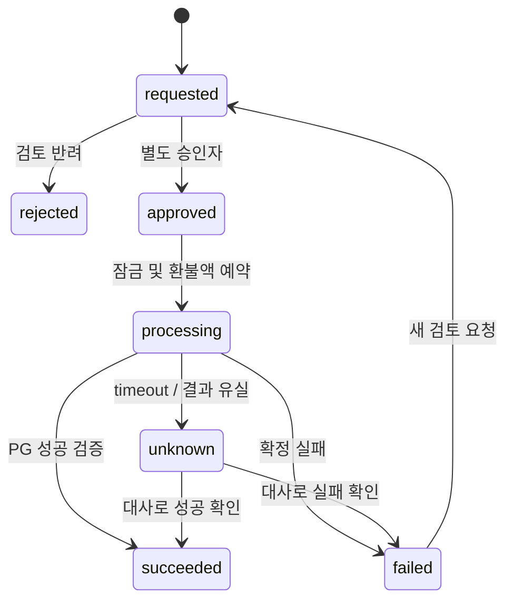

# 운영 워크플로우

## W01 콘텐츠 발행
편집자 draft 생성 → 미디어·문구·링크 검사 → in_review → 검수자 승인(내용 hash 고정) → 예약/즉시 release → 고객 화면 확인 → published.
반려 시 이유와 revision 반환. 승인 후 변경은 새 버전·재승인. 예약 취소는 아직 활성화되지 않은 작업에만 허용. 실패 시 이전 release 유지.

## W02 환불

입력은 주문 ID·금액·사유. 서버가 실제 승인·이미 환불된 금액·예약액을 검증한다. request와 approve는 다른 직원. worker가 PG adapter 호출 전 intent를 영속화한다. 성공 시 financial event와 권한 조정을 반영한다. PG 성공 후 내부 반영 실패는 별도 대사 건으로 복구한다. unknown에서는 임의 재환불 금지.
현재 주문 enum의 cancelled를 곧바로 환불 성공으로 해석하지 않는다. 고객 열람 이력은 검토 정보이며 환불 가능/불가 정책을 코드에서 임의 법적 판단하지 않는다.

## W03 결제 성공·리포트 미제공
운영 홈 알림 → 주문 상세 → PG 승인 사실·소유자·report 연결 확인 → 권한 누락/생성 실패/저장 실패/미연결 분류.
권한 누락은 승인 원장 근거로 idempotent 복구. 생성 실패는 실패 항목만 작업 생성. 저장소 장애는 의존성 복구 후 재시도. 완료 결과가 존재하면 재조회만 한다.
완료 조건: 고객용 서버 권한 검사 통과, 같은 resultId 재열람 가능, 완료 본문 hash 불변, 문의 타임라인 연결.

## W04 코퍼스 변경
출처 등록 → 라이선스·개인정보 검토 → schema validate → 판단 블록 정제 → 검색 preview → 고정 평가 → 인간 검수 → immutable 버전 승인 → release → runtime fingerprint 확인.
누락된 출처·중대 일반화 위반·평가 hash 불일치면 발행 불가. 배포 후 실패 증가 시 새 생성만 이전 snapshot으로 복구하고 완료 리포트는 유지한다.

## W05 회원 문의
접수 → triaged → assigned → investigating → awaiting_customer 또는 resolved → closed.
재문의는 reopened. 내부 메모와 고객 답변을 분리한다. 해결코드: 안내완료/권한복구/생성복구/환불처리/콘텐츠수정/중복/기타.
개인정보 열람이 필요하면 사유·대상 필드·직원 권한을 먼저 기록하고 제한 시간 동안만 응답한다.

## W06 개인정보 요청
본인확인 → 삭제/정정 대상과 보존 예외 목록 → 정책 담당 확인 → 작업 dry-run → 세션·접근권한 조치 → 삭제/익명화 → 결과 검증.
결제·감사 자료 보존기간은 확인된 운영 정책에 따라 적용한다. 이 문서는 법적 기간을 확정하지 않는다. 백업·분석집계·내보내기 복사본의 처리 범위도 기록한다.

## W07 일일 대사
KST 기준일 확정 → PG 조회 또는 검증된 파일 수집 → 원본 checksum 저장 → 내부 금융 이벤트 비교 → 미확인/중복/금액차/누락 분류 → 담당 배정 → 증빙 기반 복구 → 재대사.
재실행은 중복 거래를 만들지 않는다. 늦게 도착한 PG 결과는 해당 영업일 집계를 갱신하고 watermark를 표시한다.

## W08 장애
탐지 → 중복 incident 묶기 → 담당자·심각도 → 영향 서비스·시간 확인 → 쓰기 보류/이전 release 복구 → 고객 경로 검증 → 해결 → 원인·재발방지 WIKI 기록.
운영자 승인 없이 고객 공지 자동 발송은 하지 않는다. '조회 health 성공'과 '고객 거래·보고서 흐름 정상'을 별도 체크한다.
